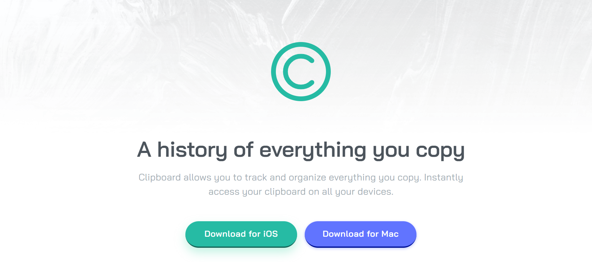
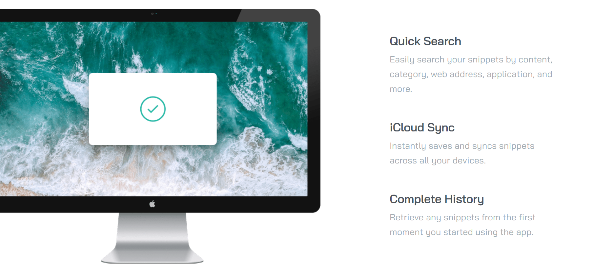
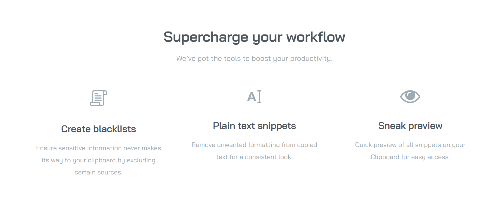
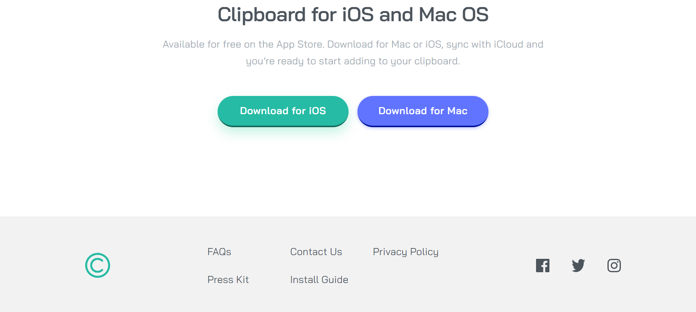

# Frontend Mentor - Clipboard landing page solution

## Table of contents

- [Overview](#overview)
  - [Screenshot](#screenshot)
  - [Links](#links)
- [My process](#my-process)
  - [Built with](#built-with)
  - [What I learned](#what-i-learned)
  - [Continued development](#continued-development)
  - [Useful resources](#useful-resources)
- [Acknowledgments](#acknowledgments)

## Overview

This is a solution to the [Clipboard landing page challenge on Frontend Mentor](https://www.frontendmentor.io/challenges/clipboard-landing-page-5cc9bccd6c4c91111378ecb9).

### Screenshot

### Links

- Solution URL: [Solution URL here](https://github.com/NunuAbuashvili/Clipboard-Landing-Page.git)
- Live Site URL: [Live site URL here](https:nunuabuashvili.github.io/Clipboard-Landing-Page/)

## My process

### Built with

- Semantic HTML5 markup
- CSS custom properties
- Flexbox
- CSS Grid
- Mobile-first workflow

### What I learned

I did not learn anything new, but this was an excellent project to practice building responsive web pages for different screen sizes. I am putting more and more effort into writing cleaner codes and trying various ways for reaching the best outcome. While working through this project the main focus was on using CSS grid settings effectively.

### Continued development

I would like to build more interactive pages using JavaScript in near future.

### Useful resources

- [CSS Color Filter Generator](https://angel-rs.github.io/css-color-filter-generator/)

## Acknowledgments

I would like to thank Bitcamp 101 (Georgia) for offering amazing lectures, and also, my mentor Paata Gharibashvili who has helped me overcome the difficulties by giving me a lot of valuable advice.
